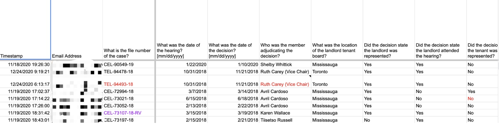
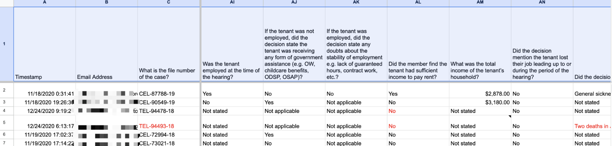
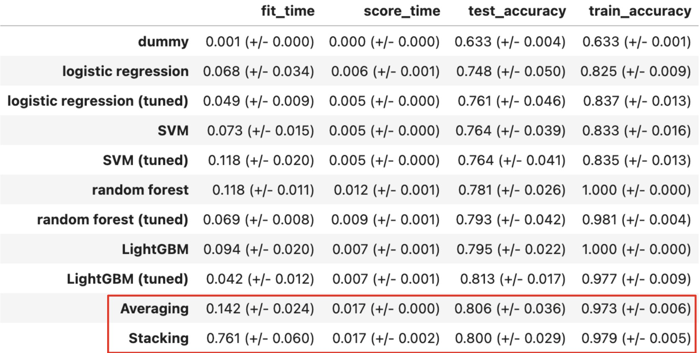

# Team Allard_1 


<details>

  <summary>Directory Structure</summary>
  
 ```
 project
 │
 └─── Web_Interface
 │   │
 │   └───__pycache__
 │   |   │   backend.cpython-310.pyc
 │   └───css
 │   |   │   about.css
 │   |   │   questionaries.css
 │   │   │   result_style.css
 │   │   │   style.css
 │   └───images
 │   |   │   README.md
 │   |   │   file112.txt
 │   |   │   ...
 |   │   README.md
 |   │   about.html
 |   │   backend.py
 |   │   backend_functions.py
 |   │   favicon.ico
 |   │   index.html
 |   │   questionaires.html
 |   │   result.html
 |   │   result_script.js
 |   │   script.js
 └─── cleaning
 |   │   Cleaning_AA_AZ.ipynb
 |   │   Cleaning_A_Z.ipynb
 |   │   Merge_Cleaned.ipynb
 └─── data
 │   │
 │   └─── formatted_cases
 │       │   .DS_Store
 │       │   CEL-62600-16.txt
 │       │   CEL-62852-16.txt
 │       │   ...
 |   │   Case_outcomes-decisions.csv
 |   │   Questionnaire.csv
 |   │   cleaned_data.csv
 |   │   cleaned_data_A-Z.csv
 |   │   cleaned_data_AA-AZ.csv
 |   │   cleaned_data_v2.csv
 └─── images
 |   │   allard_logo.png
 |   │   data_sample1.png
 |   │   data_sample2.png
 |   │   intro.png
 |   │   train_evaluate.png
 └─── models
 |   │   LightGBM.ipynb
 |   │   RandomForest.ipynb
 |   │   SVM.ipynb
 |   │   ensembles.ipynb
 |   │   logistic_regression.ipynb
 |   │   stacking_model.sav
 │   LAW EDA.ipynb
 │   README.md 
 ```

</details>

## Introduction 

The project aims to create a system that can provide brief information about the winning prediction on Residential Tenancy related issues in Ontario by analyzing 44,228 cases to understand why judges allow or deny eviction orders in Ontario's Residential Tenancy Board (RTB) under the current legislation. This is fascinating and socially significant since it helps thousands of people who are considering whether to launch the suit or not due to financial-related problems. Additionally, the current legislation's ambiguity makes it difficult for legal practitioners and academics to predict or understand the reasoning behind certain decisions. 


By gaining insights into the factors influencing judges' decisions, this project would not only revolutionize access to justice in Ontario but also show the possible combination of computer science and law.  The primary goal of the project is to create a data-driven report, with the possibility of developing an app, API, or dashboard to provide accessible insights and improve access to justice for those facing eviction.

## Table of Contents
* [Contributors](#contributors)
* [Overview of the Data](#overview-of-the-data)
* [Pre-requisites and Dependencies](#pre-requisites-and-dependencies)
* [Getting Started](#getting-started)
* [Future Work](#future-work)
* [Resources](#resources)
* [Credits](#credits)

## Contributors

* Siyu Li

* Jialiang(Justin) Ren

* Yu Tian Shen

* Francesco Strafforello
 
## Overview of the Data

### Data Overview

There are 702 samples in the data, and they are all human-annotated, which means that they are extracted by human hands. These samples are based on cases regarding residential tenancy disputes in Ontario from the year 2017 all the way to the year 2020. The people who annotated these 702 data are first/second-year law students working from 2020 to 2021. So the process is like this: they first read through the information of that case that CanLII published. Then they extract the information based on a template.

### Data Sample

* Data Sample 1


  
* Data Sample 2



### Data Preprocessing

21 Columns are dropped due to too little information presented. Yes/No questions are converted into binary 1 and 0. Then, for numeric values, to keep things consistent, we remove units like dollar signs, replace missing values with the column’s mean value, etc. Furthermore, the column “Which other specific applications of the landlord or the tenant were mentioned?” are converted into 15 binary features for each kind of application. We narrowed down the labels to three classes: relief, no relief, and conditional order; it then becomes a multi-class classification task.

After all the cleaning work, there are 696 examples and 47 features with no missing values remaining.

### Models training and Evaluation

* Training Subsets: 556(80%) samples
  
* Testing Subsets: 140(20%) samples
  
* Evaluation Metric: Accuracy


Here is the model performance. Based on 700 data. We have a baseline, which is the dummy model, with 63% accuracy on the test dataset. With this baseline, we start trying the four models: logistic regression, SVM, random forest, and LightGBM. After fine-tuning these models, we can see the best performance in LGBM with around 81% accuracy and the worst performance in logistic regression with around 76%. However, these models value different features individually, so we decide to do an ensemble of four models to achieve a more consistent and bias-free result. Although the test score of the stacking model is a bit lower than the averaging model, it has a smaller standard deviation than most models above, so we decide it as the final model.




## Pre-requisites and Dependencies

To retrain the model, several packages of Python like pandas are required. Additionally, the front-end solely won't be able to provide you with the result, it is required to host a server where you have a model to do prediction and send the result to the front-end. 

## Getting Started 


### Front-End
* Homepage

There are three buttons on the homepage: "Start", "Home", and "About". The "Home" button is supposed to take you to the homepage, but it is shown grey since it is already on the homepage. The "About" button will take you to a page where you can find more information about the project. The "Start" button will take you to the questionnaire page.

* Questionnaire Page

The questionnaire page contains multiple questions. You can reset all your answers with the "Reset" button at the beginning when answering. After answering everything, you can click on the "submit" button that takes you to the result page.
 
* Result Page

The result page is where you can get your result for your situation, it will give you three probability that corresponding to: "relief", "no relief", and "conditional order". 

### Back-End

For the backend, it retrieves the questionnaire answers as a CSV and sends it to the model for prediction, then extract these predictions and displays them on the result page

### Docker

Coming soon...

## Future Work

Other than the model we are using right now, we also tried to implement the LLM into this project, but we face several limitations in this project such as the length limitations of LLM and computing resources limitations, so it was not implemented. However, it does have the potential to achieve a better score. Future work can continue to explore the LLM model and try to apply it to this matter.

Furthermore, even though this project is on Ontario Tenancy Dispute, it does not limit to this area of law. This is a proof of concept that AI can be applied in the area of law to both help lawyers visualize different aspects of law and help the client to make decisions when facing injustice situations. As a result, future work can look at different areas of law and implement a larger model that cover every aspect of law.

## Resources

[CanLII](https://www.canlii.org/en/)

[Sklearn models page](https://scikit-learn.org/stable/modules/classes.html#module-sklearn.linear_model)

[Python Pandas](https://pandas.pydata.org/)

## Credits

We would like to thank our supervisor, Garrett Nicolai for his advice on various tasks in this project.

We would like to thank our partners Josh Morrison and Anna Welch for their support on questions in area of law.
